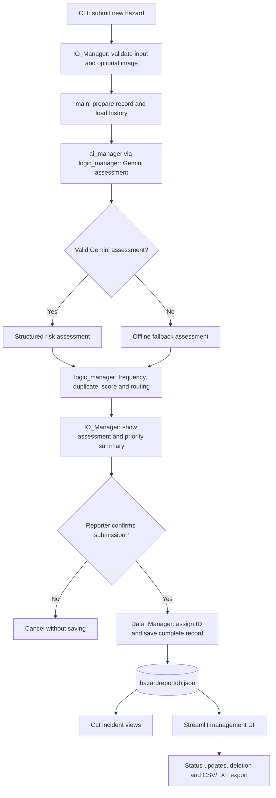

# 🛡️ Campus Safety Hazard Reporting System

**INF1103 · Team 4 · SIT Punggol Coast**

A modular Python campus hazard reporting application that lets students and staff submit facility hazards through a command-line interface (CLI). It uses Google Gemini to assess risk when available, applies rule-based priority and dispatch decisions, and stores completed incident records in a local JSON database. A separate Streamlit interface lets facilities staff review and manage incidents.

> **Project scope:** This is a prototype decision-support system. AI assessments and automated routing recommendations should be reviewed by authorised facilities personnel; the program does not itself dispatch an emergency response.

## 🎯 Project background and initial objectives

The original **Team 4 Project Initial Details** proposal identified a campus-safety problem: students and staff need a centralised way to report hazards such as electrical faults, leaks, and damaged facilities, while maintenance teams need structured information to prioritise cases and recognise recurring problems. This prototype focuses on turning those reports into records that can be assessed, prioritised, and reviewed.

### 👥 Intended users

| User group | Intended use |
| --- | --- |
| **Front-line reporters (students and teachers)** | Report facility and equipment hazards encountered in classrooms, laboratories, lecture theatres, and other campus locations. |
| **Maintenance teams and safety officers** | Review incoming incidents, identify higher-priority and recurring problems, and manage resolution progress. |

### 📝 Information collected

The original proposal specified five main inputs: **location**, **visual evidence**, **number of people affected**, **asset information**, and an **unstructured hazard description**. The implemented CLI also collects reporter name and contact details. Visual evidence is optional in the current application.

### 📌 Original goals and implementation status

| Proposed capability | Current implementation |
| --- | --- |
| Multimodal hazard submission | CLI accepts written report details and one optional PNG, JPEG or WebP image through a graphical picker or terminal path input when the GUI is unavailable. |
| AI risk summary, classification and assessment | Gemini is used to produce a risk summary, category, severity, operational impact, and contextual insights when available. |
| Historical patterns and duplicate detection | Rule-based comparisons identify prior incidents with matching location and asset details. |
| Deterministic priority and routing | Business rules calculate a score, recommend an action, and assign a queue label. |
| Human-in-the-loop oversight | Streamlit interface supports incident review and status changes; it does **not** currently offer an interface to edit AI category, severity, or routing recommendations. |
| Persist incident and dispatch | The system stores the incident and its recommended dispatch route locally; it does **not** automatically notify or dispatch a real maintenance or emergency team. |

**Design distinction:** The system generates the AI assessment and calculates hazard priority before asking the reporter to confirm submission. The reporter can review the assessment summary and either confirm or cancel. Only confirmed reports are saved to the JSON database.

## ✨ Features

- **📝 Guided hazard reporting:** Collects reporter details, location, estimated people affected, asset information, and a hazard description, with input validation.
- **📷 Optional image evidence:** Accepts PNG, JPEG and WebP images via a graphical file picker, with terminal-based path input when a graphical interface is unavailable. Copies accepted images to `uploads/` using unique filenames to avoid overwriting existing attachments.
- **🤖 AI risk assessment:** Requests a structured Gemini assessment containing category, severity, operational impact, risk summary, and contextual insights.
- **🛟 Offline fallback:** Creates a rule-based fallback assessment if Gemini is unavailable or returns an unusable response.
- **🚦 Priority and routing:** Calculates a priority score, recommends an action, and assigns a maintenance or urgent-dispatch queue label.
- **🔎 Recurring-hazard checks:** Compares new reports with historical records to identify repeated location/asset combinations and potential duplicates.
- **🗃️ Incident history:** Saves each completed report, including the original inputs, assessment, decision, ID, timestamp, and status, in `hazardreportdb.json`.
- **🖥️ Facilities management UI:** Provides a Streamlit dashboard for incident review, status updates, deletion, and CSV/TXT exports.
- **🔄 Automatic dashboard refresh:** A Streamlit fragment reloads incident records approximately every 2 seconds, allowing CLI submissions and management changes to appear without manually refreshing the page.
- **📄 Readable TXT reports:** The improved export generates separate, labelled sections for each incident instead of CSV-formatted text.

## 📁 Project structure

```text
.
├── main.py                       # CLI entry point and workflow orchestration
├── IO_Manager.py                 # Console menus, validation and image selection
├── ai_manager.py                 # Gemini requests, JSON parsing and validation
├── logic_manager.py              # Fallback, scoring, duplicates and routing
├── Data_Manager.py               # Incident IDs, JSON storage, updates and exports
├── management_ui.py              # Streamlit incident management dashboard
├── test_script.py                # 34 procedural offline automated tests
├── requirement.txt               # Python dependencies (singular filename)
├── .gitignore                    # Git exclusions
└── README.md

Generated locally (excluded from Git tracking):
├── .env                          # Private Gemini API key; never commit
├── hazardreportdb.json           # Local incident database
├── uploads/                      # Optional hazard image attachments
├── hazard_reports.csv            # Generated CSV export
└── hazard_reports.txt            # Generated TXT export
```

`hazardreportdb.json` may initially be absent; Data Manager treats a missing database as empty and creates it when the first report is saved. A clean `[]` JSON database can be included separately in the school's ZIP submission. Do not publish real reporter details, incident images, API keys or export files containing personal information.

## 🔄 How the system works



The application processes a report in this order:

1. **Input:** `IO_Manager.py` gathers and validates reporter details and optional evidence.
2. **Assessment:** `main.py` passes the record into `logic_manager.process_record()`, which calls `ai_manager.py` for Gemini processing and uses an offline assessment if necessary.
3. **Business rules:** `logic_manager.py` checks historical frequency and potential duplicates, calculates a priority score, and selects a recommended action and route.
4. **Confirmation:** `IO_Manager.py` presents the assessment and recommended action; the reporter chooses whether to save or cancel.
5. **Storage:** For confirmed submissions, `Data_Manager.py` assigns an `INCIDENT-001`-style identifier and persists the complete incident in `hazardreportdb.json`.
6. **Review:** The CLI displays reports and frequent hazards; `management_ui.py` supports facilities review and incident management.

## 🧩 Modules and responsibilities

| File | Responsibility |
| --- | --- |
| `main.py` | Coordinates input, AI assessment, business-rule evaluation, persistence, and CLI navigation; launches Streamlit as a subprocess. |
| `IO_Manager.py` | Displays the four-option CLI menu, validates reporter input, and uses Tkinter for optional image selection with a terminal fallback when no GUI is available. |
| `ai_manager.py` | Builds the Gemini prompt, attaches supported image content, calls configured models, parses JSON, and validates expected response fields. |
| `logic_manager.py` | Handles offline fallback, scoring, historical frequency, potential-duplicate detection, priority decisions, and routing. |
| `Data_Manager.py` | Loads and saves the local JSON database, generates incident IDs, queries records, updates statuses, deletes records, and exports CSV/TXT files. |
| `management_ui.py` | Shows a Streamlit incident table and details, uses `Data_Manager.load()` for incident data, enables status changes and deletion, and provides exports, with an approximately 2-second automatic refresh. |
| `test_script.py` | Runs 34 procedural offline automated tests, including mocked Gemini requests and temporary JSON databases. |

## ✅ Prerequisites

- **Python 3.10 or newer** (the updated Streamlit dashboard uses union type annotations such as `list[dict[str, Any]] | None`).
- `pip` and access to install Python dependencies.
- A graphical environment with Tkinter for the native image picker; where unavailable, the CLI accepts an image file path instead.
- A Gemini API key for live AI analysis. Without a usable key or service, the normal submission workflow uses an offline fallback assessment.

## 🛠️ Installation

1. Clone the repository and enter the project directory:

   ```bash
   git clone https://github.com/2603229/INF1103_P3_T4.git
   cd INF1103_P3_T4
   ```

2. (Recommended) Create and activate a virtual environment:

   **Windows PowerShell:**

   ```powershell
   python -m venv .venv
   .\.venv\Scripts\Activate.ps1
   ```

   **macOS/Linux:**

   ```bash
   python3 -m venv .venv
   source .venv/bin/activate
   ```

3. Install dependencies from the provided file:

   ```bash
   python -m pip install -r requirement.txt
   ```

4. Create a local `.env` file in the project root:

   ```dotenv
   GEMINI_API_KEY=replace_with_your_gemini_api_key
   ```

   Keep `.env` private. It is excluded by the supplied `.gitignore`. Never place a real API key in the README or a Git commit.

## ▶️ Running the application

Start the combined CLI + management UI using:

```bash
python main.py
```

The CLI offers four options:

| Option | Action |
| --- | --- |
| `1` | Submit New Hazard Report |
| `2` | View All Logged Incidents |
| `3` | View Top 5 Most Frequent Hazards |
| `4` | Exit |

`main.py` also starts Streamlit in a subprocess. To run **only** the facilities management dashboard, use:

```bash
python -m streamlit run management_ui.py
```

Streamlit is typically available locally at `http://localhost:8501`. When launched from `main.py`, its terminal output is suppressed, so open that address manually if necessary. The dashboard shows a message when the database is missing or empty and rechecks it automatically. Exiting the CLI shuts down the Streamlit subprocess in the updated `main.py`.

### 📋 Submitting a report

Choose option `1` and enter the requested reporter name, SIT email or Singapore phone number, location, estimated affected headcount, asset summary, and detailed description. Optionally attach a PNG, JPEG or WebP image through the file picker or terminal path input if the GUI is unavailable. The application assesses the report, checks historical records, determines priority and routing, and presents a pre-submission summary. It saves the complete report only after the reporter confirms.

The current input checks include:

- A reporter name using supported letters and punctuation.
- An `@sit.singaporetech.edu.sg` email or a validated eight-digit phone number.
- A nonempty location.
- An affected headcount from **1 to 1,000**.
- An asset summary of at least **3 characters**.
- A hazard description of at least **15 characters**.

## 🤖 AI assessment and fallback

The Gemini response is expected to contain these five string fields:

| Field | Expected content |
| --- | --- |
| `risk_summary` | Concise safety risk summary |
| `category` | `Electrical`, `Plumbing`, `Structural`, `HVAC`, or `IT/Equipment` |
| `severity` | `Low`, `Medium`, `High`, or `Critical` |
| `operational_impact` | `Minor`, `Moderate`, `Severe`, or `Catastrophic` |
| `contextual_insights` | Explanation and relevant safety considerations |

`ai_manager.py` uses the official Google GenAI SDK to request a structured JSON hazard assessment. The configured model candidates are `gemini-3.8-flash` and `gemini-3.6-flash`; live assessment depends on those model IDs being available to the configured API account. Model availability has not been independently verified.

Each HTTP request is configured with a **60-second timeout**. The application handles rate-limit errors (429), retries some temporary failures (such as 503), and switches between configured models where appropriate. The timeout applies **per HTTP request**, not to the entire assessment workflow; retries and model fallback can extend total processing time.

If the API is unavailable or returns an invalid assessment, the system generates a **provisional offline fallback** for human review. Its category can differ from the five allowed Gemini categories. A fallback triggered by an attached image **does not mean the image was analysed**. All assessments and routing recommendations require verification by authorised facilities personnel.

## 🚦 Priority and incident management

The Logic Manager calculates priority using three factors: **severity**, **operational impact**, and **historical frequency**. Severity contributes 1 (Low), 2 (Medium), 4 (High), or 5 (Critical) points. Operational impact contributes 1 (Minor), 2 (Moderate), 4 (Severe), or 5 (Catastrophic) points. Historical frequency adds 0–3 points based on the number of previous reports involving the same location and asset.

The total score and business rules determine **Normal**, **High**, or **Critical** priority, along with a recommended action. The `route(record)` function assigns the appropriate maintenance or urgent-dispatch **queue label** based on the evaluated priority; it does not dispatch personnel. Duplicate detection flags matching unresolved incidents. `Resolved` and `Closed` reports are excluded from active duplicate checks but still count toward historical frequency.

Each saved record includes an incident identifier, timestamp, reporter input, assessment source, assessment fields, duplicate/frequency information, score, recommended action, assigned route, and status. Data is stored in the local `hazardreportdb.json` file.

In the Streamlit dashboard, facilities staff can view incidents sorted by score, inspect assessment details and image evidence where available, change a status among **Pending Review**, **In Progress**, **Resolved**, and **Closed**, delete a record after confirmation, and export incident records to **CSV** or **readable TXT**. The dashboard uses `@st.fragment(run_every="2s")` to reload data periodically. Status updates and deletions trigger an immediate fragment rerun. Generated downloads are retained in Streamlit session state so the download buttons remain available across automatic refreshes.

## ⚙️ Configuration and data files

| Setting | Purpose |
| --- | --- |
| `GEMINI_API_KEY` | API key used by `ai_manager.py` for Gemini requests. |
| `INCIDENTS_DB` | Optional override for the JSON database location used by `Data_Manager.py` and the Streamlit UI. |
| `HAZARD_DATA_DIR` | Optional data directory for `Data_Manager.py` when `INCIDENTS_DB` is not set. |

**Database management:** Incident database reads and writes are centralised in `Data_Manager.py`. Both the main CLI and Streamlit management dashboard retrieve incidents through Data Manager. By default, records are stored in `hazardreportdb.json`. The `INCIDENTS_DB` and `HAZARD_DATA_DIR` environment variables allow alternate storage paths.

## 🧪 Automated Testing

The project includes `test_script.py`, containing **34 procedural offline automated tests** without class definitions.

| Test area | What is covered |
| --- | --- |
| AI Manager | Prompt creation, response validation, JSON parsing, and mocked API requests |
| Logic Manager | Priority scoring, evaluation, duplicate detection, and fallback behaviour |
| Data Manager | Database load/save, IDs, status updates, deletion, and malformed JSON handling |
| IO Manager | Submission confirmation input handling |
| Main workflow | Saving confirmed reports and not saving cancelled reports |

Run from the project root:

```bash
python test_script.py
```

For individual test results, or to run without database tests:

```bash
python test_script.py --details
python test_script.py --no-data
```

Gemini calls are mocked so the test suite does **not** require a live API key or network access. Data Manager tests use temporary JSON files to avoid changing the actual incident database. Manually verify Streamlit functionality, image attachment, and live Gemini assessment separately.

## 👥 Created By

🎓 **INF1103 – Programming Fundamentals with DevOps**  
🏫 **Team 4 | Singapore Institute of Technology (SIT)**

### 👨‍💻 Team Members

- CHAN RUI RU
- CHEE BO YU
- KOH KA-WEI DARRYL
- CHUA QIN NI JAMIE
- KHUN AUNG HEIN
- CHIA SENG CHAN

## 🔗 Repository

[INF1103 Team 4 – GitHub](https://github.com/2603229/INF1103_P3_T4)