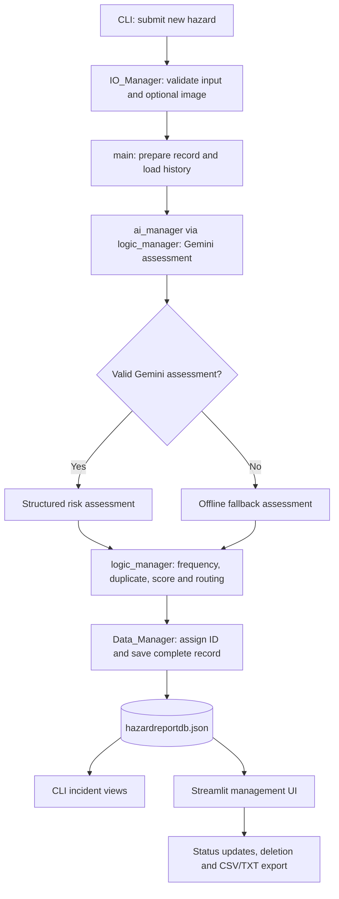

# 🛡️ Campus Safety Hazard Reporting System

**INF1103 · Team 4 · SIT Punggol Coast**

A modular Python campus hazard reporting application that lets students and staff submit facility hazards through a command-line interface (CLI). It uses Google Gemini to assess risk when available, applies rule-based priority and dispatch decisions, and stores completed incident records in a local JSON database. A separate Streamlit interface lets facilities staff review and manage incidents.

> **Project scope:** This is a prototype decision-support system. AI assessments and automated routing recommendations should be reviewed by authorised facilities personnel; the program does not itself dispatch an emergency response.

## 🎯 Project background and initial objectives

The original **Team 4 Project Initial Details** proposal identified a campus-safety problem: students and staff need a centralised way to report hazards such as electrical faults, leaks, and damaged facilities, while maintenance teams need structured information to prioritise cases and recognise recurring problems. This prototype focuses on turning those reports into records that can be assessed, prioritised, and reviewed.

### 👥 Intended users

| User group | Intended use |
| --- | --- |
| **Front-line reporters (students and teachers)** | Report facility and equipment hazards encountered in classrooms, laboratories, lecture theatres, and other campus locations. |
| **Maintenance teams and safety officers** | Review incoming incidents, identify higher-priority and recurring problems, and manage resolution progress. |

### 📝 Information collected

The original proposal specified five main inputs: **location**, **visual evidence**, **number of people affected**, **asset information**, and an **unstructured hazard description**. The implemented CLI also collects reporter name and contact details. Visual evidence is optional in the current application.

### 📌 Original goals and implementation status

| Proposed capability | Current implementation |
| --- | --- |
| Multimodal hazard submission | CLI accepts written report details and one optional image selected through a file picker. |
| AI risk summary, classification and assessment | Gemini is used to produce a risk summary, category, severity, operational impact, and contextual insights when available. |
| Historical patterns and duplicate detection | Rule-based comparisons identify prior incidents with matching location and asset details. |
| Deterministic priority and routing | Business rules calculate a score, recommend an action, and assign a queue label. |
| Human-in-the-loop oversight | Streamlit interface supports incident review and status changes; it does **not** currently offer an interface to edit AI category, severity, or routing recommendations. |
| Persist incident and dispatch | The system stores the incident and its recommended dispatch route locally; it does **not** automatically notify or dispatch a real maintenance or emergency team. |

**Design distinction:** The original proposal described a risk summary for users to review *before* submission. The current workflow generates and displays the assessment during submission processing and saves the completed record; it does not implement a separate pre-submission approval stage.

## ✨ Features

- **📝 Guided hazard reporting:** Collects reporter details, location, estimated people affected, asset information, and a hazard description, with input validation.
- **📷 Optional image evidence:** Opens a native file picker and copies the selected image into the local `uploads/` folder.
- **🤖 AI risk assessment:** Requests a structured Gemini assessment containing category, severity, operational impact, risk summary, and contextual insights.
- **🛟 Offline fallback:** Creates a rule-based fallback assessment if Gemini is unavailable or returns an unusable response.
- **🚦 Priority and routing:** Calculates a priority score, recommends an action, and assigns a maintenance or urgent-dispatch queue label.
- **🔎 Recurring-hazard checks:** Compares new reports with historical records to identify repeated location/asset combinations and potential duplicates.
- **🗃️ Incident history:** Saves each completed report, including the original inputs, assessment, decision, ID, timestamp, and status, in `hazardreportdb.json`.
- **🖥️ Facilities management UI:** Provides a Streamlit dashboard for incident review, status updates, deletion, and CSV/TXT exports.
- **🔄 Automatic dashboard refresh:** A Streamlit fragment reloads incident records approximately every 2 seconds, allowing CLI submissions and management changes to appear without manually refreshing the page.
- **📄 Readable TXT reports:** The improved export generates separate, labelled sections for each incident instead of CSV-formatted text.

## 📁 Project structure

```text
.
├── main.py                       # CLI entry point and workflow orchestration
├── IO_Manager.py                 # Console menus, validated input, image file picker
├── ai_manager.py                 # Gemini requests, response parsing and validation
├── logic_manager.py              # Fallback, priority, duplicates and routing
├── Data_Manager.py               # Incident IDs, JSON storage, updates and exports
├── management_ui.py              # Streamlit incident management dashboard
├── hazardreportdb.json           # Local incident records
├── requirement.txt               # Python dependencies (filename is singular)
├── .gitignore                    # Git exclusions
├── .env                          # Local API key; DO NOT commit
└── README.md
```

The `uploads/` directory is created when an image is attached. The management UI generates `hazard_reports.csv` and `hazard_reports.txt` on request. The sample export files can be included in the repository if they contain only fictional/test information.

## 🔄 How the system works



The application processes a report in this order:

1. **Input:** `IO_Manager.py` gathers and validates reporter details and optional evidence.
2. **Assessment:** `main.py` passes the record into `logic_manager.process_record()`, which calls `ai_manager.py` for Gemini processing and uses an offline assessment if necessary.
3. **Business rules:** `logic_manager.py` checks historical frequency and potential duplicates, calculates a priority score, and selects a recommended action and route.
4. **Storage:** `Data_Manager.py` assigns an `INCIDENT-001`-style identifier and persists the complete incident in `hazardreportdb.json`.
5. **Review:** The CLI displays reports and frequent hazards; `management_ui.py` supports facilities review and incident management.

## 🧩 Modules and responsibilities

| File | Responsibility |
| --- | --- |
| `main.py` | Coordinates input, AI assessment, business-rule evaluation, persistence, and CLI navigation; launches Streamlit as a subprocess. |
| `IO_Manager.py` | Displays the four-option CLI menu, validates reporter input, and uses Tkinter for optional image selection. |
| `ai_manager.py` | Builds the Gemini prompt, attaches supported image content, calls configured models, parses JSON, and validates expected response fields. |
| `logic_manager.py` | Handles offline fallback, scoring, historical frequency, potential-duplicate detection, priority decisions, and routing. |
| `Data_Manager.py` | Loads and saves the local JSON database, generates incident IDs, queries records, updates statuses, deletes records, and exports CSV/TXT files. |
| `management_ui.py` | Shows a Streamlit incident table and details, enables incident status changes and deletion, and provides exports, with an approximately 2-second automatic data refresh. |

## ✅ Prerequisites

- **Python 3.10 or newer** (the updated Streamlit dashboard uses union type annotations such as `list[dict[str, Any]] | None`).
- `pip` and access to install Python dependencies.
- A desktop environment with Tkinter support **if attaching images using the file picker**.
- A Gemini API key for live AI analysis. Without a usable key or service, the normal submission workflow uses an offline fallback assessment.

## 🛠️ Installation

1. Clone the repository and enter the project directory:

   ```bash
   git clone https://github.com/2603229/INF1103_P3_T4.git
   cd INF1103_P3_T4
   ```

2. (Recommended) Create and activate a virtual environment:

   **Windows PowerShell:**

   ```powershell
   python -m venv .venv
   .\.venv\Scripts\Activate.ps1
   ```

   **macOS/Linux:**

   ```bash
   python3 -m venv .venv
   source .venv/bin/activate
   ```

3. Install dependencies from the provided file:

   ```bash
   python -m pip install -r requirement.txt
   ```

4. Create a local `.env` file in the project root:

   ```dotenv
   GEMINI_API_KEY=replace_with_your_gemini_api_key
   ```

   Keep `.env` private. It is excluded by the supplied `.gitignore`. Never place a real API key in the README or a Git commit.

## ▶️ Running the application

Start the combined CLI + management UI using:

```bash
python main.py
```

The CLI offers four options:

| Option | Action |
| --- | --- |
| `1` | Submit New Hazard Report |
| `2` | View All Logged Incidents |
| `3` | View Top 5 Most Frequent Hazards |
| `4` | Exit |

`main.py` also starts Streamlit in a subprocess. To run **only** the facilities management dashboard, use:

```bash
python -m streamlit run management_ui.py
```

Streamlit is typically available locally at `http://localhost:8501`. When launched from `main.py`, its terminal output is suppressed, so open that address manually if necessary. The dashboard shows a message when the database is missing or empty and rechecks it automatically. Exiting the CLI shuts down the Streamlit subprocess in the updated `main.py`.

### 📋 Submitting a report

Choose option `1` and enter the requested reporter name, SIT email or Singapore phone number, location, estimated affected headcount, asset summary, and detailed description. Optionally select an image through the file picker. The application assesses the report, checks historical records, determines priority and routing, saves it, and displays the result.

The current input checks include:

- A reporter name using supported letters and punctuation.
- An `@sit.singaporetech.edu.sg` email or a validated eight-digit phone number.
- A nonempty location.
- An affected headcount from **1 to 1,000**.
- An asset summary of at least **3 characters**.
- A hazard description of at least **15 characters**.

## 🤖 AI assessment and fallback

The Gemini response is expected to contain these five string fields:

| Field | Expected content |
| --- | --- |
| `risk_summary` | Concise safety risk summary |
| `category` | `Electrical`, `Plumbing`, `Structural`, `HVAC`, or `IT/Equipment` |
| `severity` | `Low`, `Medium`, `High`, or `Critical` |
| `operational_impact` | `Minor`, `Moderate`, `Severe`, or `Catastrophic` |
| `contextual_insights` | Explanation and relevant safety considerations |

`ai_manager.py` currently lists `gemini-3.8-flash` and `gemini-3.6-flash` as its model candidates. These names must be supported by your Google AI account for live assessment to work. The code handles quota/rate-limit failures (429), retries some temporary service errors (503), and defines a 300-second wait for an API result. A fallback assessment is used when a valid Gemini assessment cannot be obtained.

**Note:** The fallback is a predefined rule-based response, not a substitute for an on-site inspection. Its categories can differ from the validated Gemini categories. A fallback triggered by an attached image does not mean that the image was successfully analysed. The 300-second `future.result()` wait does not guarantee the worker thread stops after that time.

## 🚦 Priority and incident management

The business-logic layer combines severity, safety-risk defaults, operational impact, and historical frequency into a score. It applies decision rules to assign priorities such as **Normal**, **High**, or **Critical**, along with a recommended action and assigned queue. Duplicate checking looks for active, matching location/asset reports. In the revised rule, incidents with a status of `Resolved` or `Closed` are excluded from active duplicate detection; historical frequency still counts prior matching reports.

Each saved record includes an incident identifier, timestamp, reporter input, assessment source, assessment fields, duplicate/frequency information, score, recommended action, assigned route, and status. Data is stored in the local `hazardreportdb.json` file.

In the Streamlit dashboard, facilities staff can view incidents sorted by score, inspect assessment details and image evidence where available, change a status among **Pending Review**, **In Progress**, **Resolved**, and **Closed**, delete a record after confirmation, and export incident records to **CSV** or **readable TXT**. The dashboard uses `@st.fragment(run_every="2s")` to reload data periodically. Status updates and deletions trigger an immediate fragment rerun. Generated downloads are retained in Streamlit session state so the download buttons remain available across automatic refreshes.

## ⚙️ Configuration and data files

| Setting | Purpose |
| --- | --- |
| `GEMINI_API_KEY` | API key used by `ai_manager.py` for Gemini requests. |
| `INCIDENTS_DB` | Optional override for the JSON database location used by `Data_Manager.py` and the Streamlit UI. |
| `HAZARD_DATA_DIR` | Optional data directory for `Data_Manager.py` when `INCIDENTS_DB` is not set. |

**Data-path caveat:** `IO_Manager.py` currently reads the database from its own project directory, while `Data_Manager.py` supports the overrides above. For consistent behaviour across the CLI and dashboard, keep the default database path unless the code is updated to use a shared configuration.

## ⚠️ Known limitations

- Requires local filesystem access; the JSON file is not a multi-user database.
- When no incident data exists, the dashboard shows an informational message rather than an incident table; it continues checking for new records.
- AI output is probabilistic and may require manual verification; fallback assessments are generic.
- The updated dashboard resolves relative `image_path` values against the project directory; images that are absent on the current machine cannot be displayed.
- The dashboard updates approximately every 2 seconds, not instantaneously. Periodic refresh may affect controls during interaction and should be tested. Exported download content remains the version generated when the Export button was last clicked.
- The API thread-pool wait is not a guaranteed strict 300-second total execution timeout; a running request may continue past that limit.
- Some priority-score branches reference values such as `safety_risk` that are not supplied by the current five-field Gemini schema; the scoring function uses its own default when those values are absent.
- The project files supplied with this README do not include a standalone automated test script, Dockerfile, or Excel-export implementation. Do not assume those deliverables are present without adding them.

## 🧪 Suggested verification before submission

1. Run `python main.py` and submit a report with and without an image. Confirm the AI assessment or offline fallback is recorded.
2. Leave Streamlit open at `http://localhost:8501`; submit a report in the terminal and verify the dashboard reflects it after approximately 2 seconds.
3. Verify status updates (`Pending Review` → `In Progress` → `Resolved`/`Closed`) and delete a test incident using the dashboard.
4. Export and download both `hazard_reports.csv` and `hazard_reports.txt`. Confirm that the TXT file has readable incident sections without repeated separators.
5. Confirm matching active records are detected as potential duplicates and resolved/closed records do not count as active duplicates.
6. Exit using menu option `4` or Ctrl+C and confirm the launched Streamlit process terminates.
7. Before pushing, check `git status` and ensure `.env` or any real confidential reporter information is not committed.

---

## 👥 Created By

🎓 **INF1103 – Programming Fundamentals with DevOps**  
🏫 **Team 4 | Singapore Institute of Technology (SIT)**

### 👨‍💻 Team Members

- CHAN RUI RU
- CHEE BO YU
- KOH KA-WEI DARRYL
- CHUA QIN NI JAMIE
- KHUN AUNG HEIN
- CHIA SENG CHAN

## 🔗 Repository

[INF1103 Team 4 – GitHub](https://github.com/2603229/INF1103_P3_T4)