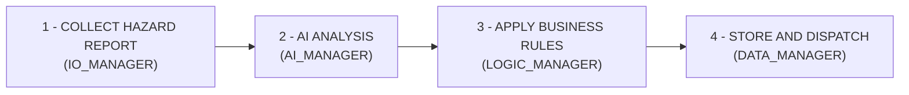

# **Project Initial Details - Team 4** 

**Project Repository:** **<u>https://github.com/2603229/INF1103_P3_T4.git</u>** 

## **Problem Statement** 

Campus safety is routinely compromised because students and campus members lack an intuitive, centralised mechanism to report real-time hazards such as electrical faults, severe leaks or damaged infrastructure as they encounter them. With small maintenance teams overwhelmed by unstructured feedback, reported risks are prioritised or delayed inefficiently, while recurring equipment failures go untracked, leaving active safety hazards on campus unaddressed. 

## **Target User** 

**Front-Line Reporters (Students and Teachers):** Encounter daily facility and equipment faults across classrooms, labs and lecture halls requiring a seamless, intuitive reporting experience. 

**Compliance & Oversight (Maintenance team and Safety Officers):** Audit high-risk safety hazards, monitor recurring equipment failures and ensure campus-wide compliance with safety regulations using specialised analytical insights. 

## **User Inputs** 

To initiate a fault report, students and teachers provide a multi-modal set of inputs to the system: 

- **Location:** Specific area, building, floor or room identifier (e.g., computer lab, lecture theatre) 

- **Visual Evidence:** Picture(s) of the hazard captured by the user for automated safety inspection 

- **Impact:** How many people are affected by the issue (e.g., student headcount in a computer lab, entire lecture theater etc.) 

- **Asset Information:** The specific equipment or item involved (e.g., electrical socket, projector, air-conditioning unit) 

- **Unstructured Description:** Natural language text detailing the nature of the problem in their own words 

## **Use of AI** 

The application leverages artificial intelligence (computer vision and natural language processing) across three core stages to transform raw user reports into actionable intelligence: 

- **Pre-Submission Validation & Summarisation:** When a student or teacher uploads a hazard photo and a brief note, the AI analyses the multi-modal input using computer vision and natural language processing to produce a concise, bulleted risk summary for the user to review before submission. 

- **Automated Data Extraction & Risk Assessment:** The AI processes user inputs to automatically generate and categorize: 

   - **Category of the problem** 

   - **Severity level and potential safety risks** 

   - **Operational impact** 

   - **Relevant explanations and contextual insights** 

- **Advanced Analytics & Decision Support:** Once logged, the AI assists safety officers and maintenance teams by: 

   - Evaluating issue urgency and detecting recurring pattern frequencies across historical campus records 

   - Generating contextual repair and remediation recommendations to guide safety officers and maintenance personnel in resolving hazards 

## **Business Rules** 

The system applies automated validations, data integrity checks and decision-making logic to all processed reports: 

- **Incident Management:** Generates a unique Incident ID for every submission and securely links the incident with its original multi-modal user input and AI analysis 

- **Automated Deduplication & Trend Checking:** Automatically checks historical incident data to flag duplicate submissions and detect recurring equipment faults 

- **Deterministic Priority Matrix:** Determines the final priority ranking based on severity, safety risk, operational impact and historical frequency 

- **Human-in-the-Loop Override:** Empowers authorised staff (such as safety officers) to review, adjust and override AI recommendations when necessary 

- **Database Storage & Dispatch:** Stores the fully processed incident record including the Incident ID, AI analysis, final priority, recommendation and current status, while routing the finalized ticket to the maintenance team for action. 